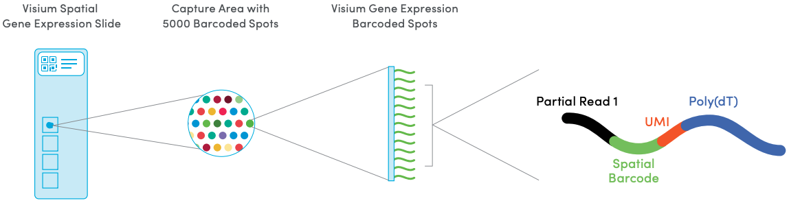

# Spatially resolved transcriptomics

Spatially resolved transcriptomics (ST) technologies allow transcriptome-wide gene expression to be measured at spatial resolution. There are several technological platforms, each with their unique advantages. ST was named the Method of the Year by Nature Methods in 2020 [@Mark2020] and we expect that it will help put genome-wide expression on the map [@Maynard2020Spatial].

Here we describe the platforms used to generate the example datasets in this book.

```{r, echo=FALSE, out.width = "100%", fig.align="center", fig.cap="Illustration of potential uses of spatially resolved transcriptomics data and how it can be combined with single cell/nucleus RNA-seq to study tissues of interest such as the human brain. Source: [Maynard et al, _Neuropsychopharmacol._, 2020](https://doi.org/10.1038/s41386-019-0484-7)."}
knitr::include_graphics("images/Maynard2020_spatial.png")
```


## 10x Genomics Visium

The [10x Genomics Visium](https://www.10xgenomics.com/products/spatial-gene-expression) platform measures transcriptome-wide gene expression at a two-dimensional grid of "spots" on a tissue slide. Fresh-frozen tissue is placed onto the slide, fixed, stained, and permeabilized. Each spot contains millions of spatially-barcoded capture oligonucleotides, which bind to mRNAs from the tissue. A cDNA library is then generated for sequencing, which includes the spatial barcodes, allowing reads to be mapped back to their spatial locations.

The dimensions of the tissue slide are approximately 6.5mm by 6.5mm, and contains around 5000 barcoded spots. Spots are located in a regular hexagonal arrangement, with each spot 55µm in diameter, and 100µm center to center. The number of cells per spot depends on the organism and tissue type, e.g. 0-10 for human brain, or around 50 for mouse brain. Each slide contains 4 capture areas (6.5mm x 6.5mm each). The following figure provides an illustration.

This platform is commercially available from 10x Genomics, making it relatively accessible, affordable, and easy for new labs to get started with, especially compared to platforms that require more specialized equipment and expertise. In our view, this makes it likely that Visium (and its future extensions) will see widespread adoption over the coming years.


```{r Visium-schematic, echo=FALSE, fig.wide=TRUE, fig.align="center", fig.cap="Schematic of 10x Genomics Visium platform. Source: [10x Genomics Visium website](https://www.10xgenomics.com/spatial-transcriptomics/)"}

```


## Additional platforms

Additional platforms include the following.

Spot-based platforms:

- [Slide-seqV2](https://www.nature.com/articles/s41587-020-0739-1) [@Stickels2020]


Molecule-based platforms:

- [SeqFISH+](https://www.nature.com/articles/s41586-019-1049-y) [@Eng2019]
- [MERFISH](https://www.pnas.org/content/116/39/19490) [@Xia2019]

