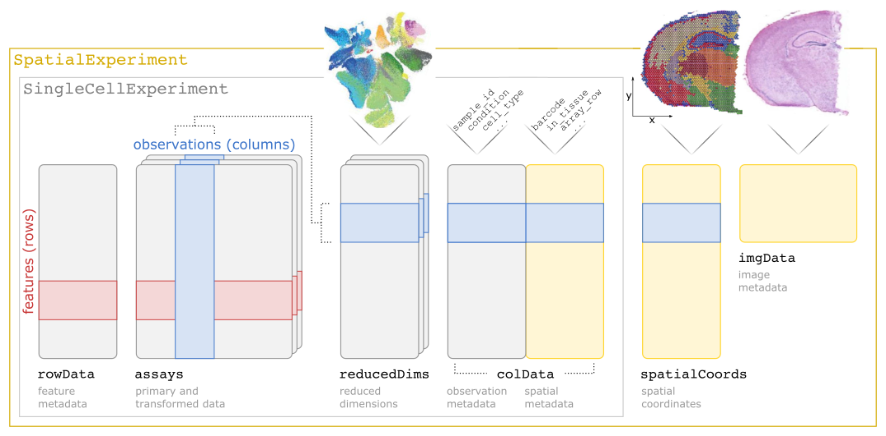

# SpatialExperiment

In this book, we use the [SpatialExperiment](https://bioconductor.org/packages/SpatialExperiment) class from Bioconductor as the main data structure for storing data objects.


## SpatialExperiment class

`SpatialExperiment` is a specialized object class for storing spatially resolved transcriptomics datasets from several technological platforms within the Bioconductor framework.

The class builds on the more general [SingleCellExperiment](https://bioconductor.org/packages/SingleCellExperiment) class for single-cell RNA sequencing data, with additional customizations to store spatial information, such as spatial coordinates and image files.

A summary of the `SpatialExperiment` object structure is show in the following figure. Briefly, a `SpatialExperiment` object consists of (i) `assays` containing expression counts, (ii) `rowData` containing information on features i.e. genes, (iii) `colData` containing information on spots or cells, (iv) `spatialData` containing spatial coordinates and other spatial information, and (v) `imgData` containing information on image files. For spot-based ST data (e.g. 10x Genomics Visium), a single `assay` named `counts` is used. For molecule-based ST data (e.g. seqFISH), two `assays` named `counts` and `molecules` are used.

For more details, see our paper [SpatialExperiment: infrastructure for spatially resolved transcriptomics data in R using Bioconductor](https://www.biorxiv.org/content/10.1101/2021.01.27.428431v1) (currently available as a preprint from bioRxiv).


```{r spe-schematic, echo=FALSE, out.width = "50%", fig.cap="Overview of the `SpatialExperiment` object class for storing spatially resolved transcriptomics datasets in the Bioconductor framework."}

```


